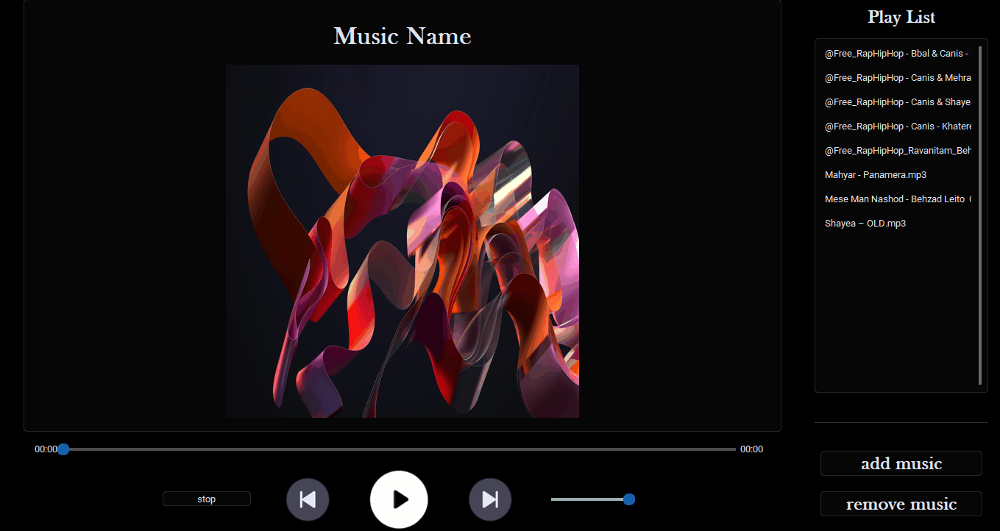

# 🎵 موزیک پلیر (نسخه پایه)

> 📌 بخشی از مسیر یادگیری مهندسی نرم‌افزار موسیقی
> [مسیر توسعه](https://github.com/amin-soleimani1/music-engineering-journey)

🌐 **زبان:** فارسی | [English](README.md)

## مرحله اول — یادگیری مبانی توسعه اپلیکیشن‌های دسکتاپ

این پروژه یک موزیک پلیر دسکتاپ است که با استفاده از **Python** و **CustomTkinter** توسعه داده شده است.

هدف اصلی این پروژه یادگیری مفاهیم پایه توسعه نرم‌افزارهای دسکتاپ، طراحی رابط کاربری، سازمان‌دهی پروژه و پخش فایل‌های صوتی در پایتون بوده است.

## 🔗 مسیر پروژه

⬅️ **مرحله قبل**

وجود ندارد

➡️ **مرحله بعد**

[مدیر کتابخانه موسیقی](https://github.com/amin-soleimani1/Music-Library-Manager/blob/main/README.fa.md)

> **توجه !**
>
> این پروژه صرفاً با هدف یادگیری و تمرین توسعه نرم‌افزار ایجاد شده است و یک محصول نهایی یا آماده استفاده تجاری محسوب نمی‌شود.

---

# پیش‌نمایش

### رابط کاربری

<p align="center">
  
</p>

---

# قابلیت‌ها

## 🎵 پخش موسیقی

- پخش فایل‌های موسیقی محلی
- پخش و توقف موسیقی
- رفتن به آهنگ قبلی و بعدی
- مدیریت پلی‌لیست

## 🖼 نمایش کاور آلبوم

- نمایش تصویر آلبوم در صورت وجود
- نمایش تصویر پیش‌فرض در صورت نبود کاور

## 🖥 رابط کاربری

- رابط کاربری ساخته‌شده با CustomTkinter
- طراحی ساده و خوانا
- کنترل‌های پایه پخش موسیقی

---

# فناوری‌های استفاده‌شده

- Python
- CustomTkinter
- CTkListbox
- pygame
- Pillow
- music_tag

---

# ساختار پروژه

ساختار پروژه به‌صورت ماژولار طراحی شده تا بخش‌های مختلف برنامه از یکدیگر جدا باشند و نگهداری کد ساده‌تر شود.

```text
Music Player Basic/
│
├── main.py                  # نقطه ورود برنامه
│
├── app/                     # لایه برنامه
│   ├── app.py               # مقداردهی اولیه برنامه
│   └── controllers.py       # کنترلرهای برنامه
│
├── core/                    # منطق اصلی برنامه
│   ├── player.py            # موتور پخش موسیقی
│   └── playlist.py          # مدیریت پلی‌لیست
│
├── ui/                      # رابط کاربری
│   └── main_window.py       # پنجره اصلی برنامه
│
└── assets/                  # منابع ثابت
    ├── icons/               # آیکون‌های برنامه
    └── images/              # تصاویر آلبوم و رابط کاربری

```

---

# آموخته‌های این پروژه

در طول توسعه این پروژه با مفاهیم زیر آشنا شدم:

- توسعه اپلیکیشن دسکتاپ با Python
- طراحی رابط کاربری با CustomTkinter
- پخش فایل‌های صوتی با pygame
- ساختاردهی پروژه
- مدیریت فایل‌ها
- مدیریت پلی‌لیست

این پروژه پایه‌ای برای نسخه بعدی بود که در آن از پایگاه داده SQLite، معماری بهتر و ساختار سازمان‌یافته‌تر استفاده کردم.

---

# پیش‌نیازها

- پایتون نسخه 3.10 یا بالاتر (تست‌شده روی نسخه‌های 3.10، 3.11 و 3.12)

---

# نصب و اجرا

دریافت پروژه:

```bash
git clone https://github.com/amin-soleimani1/music-player-basic.git
```

ساخت محیط مجازی:

```bash
python -m venv .venv
```

فعال‌سازی محیط مجازی و نصب وابستگی‌ها:

```bash
pip install -r requirements.txt
```

اجرای برنامه:

```bash
python main.py
```

---

# ساخت فایل اجرایی (اختیاری)

```bash
pyinstaller --onefile --windowed main.py
```

---

# گام بعدی

در پروژه بعدی این برنامه توسعه داده شد و قابلیت‌های زیر به آن اضافه شدند:

- استفاده از پایگاه داده SQLite
- معماری بهتر
- بهبود تجربه کاربری
- بازآرایی کد (Refactoring)
- سازمان‌دهی بهتر پروژه

➡️ Music Library Manager

---

# مجوز

این مخزن صرفاً با هدف آموزش منتشر شده است.

می‌توانید کدها را مطالعه کرده و از آن‌ها در مسیر یادگیری خود استفاده کنید.
